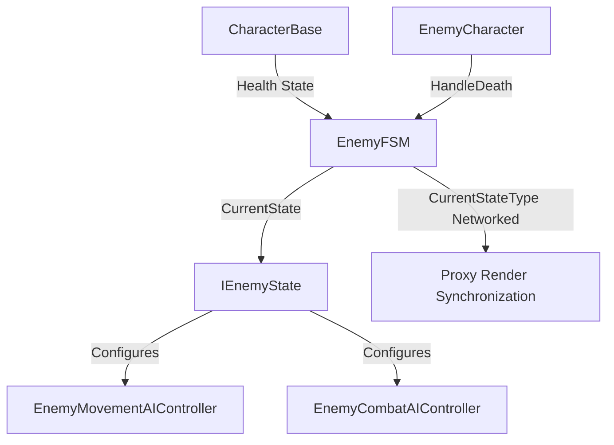
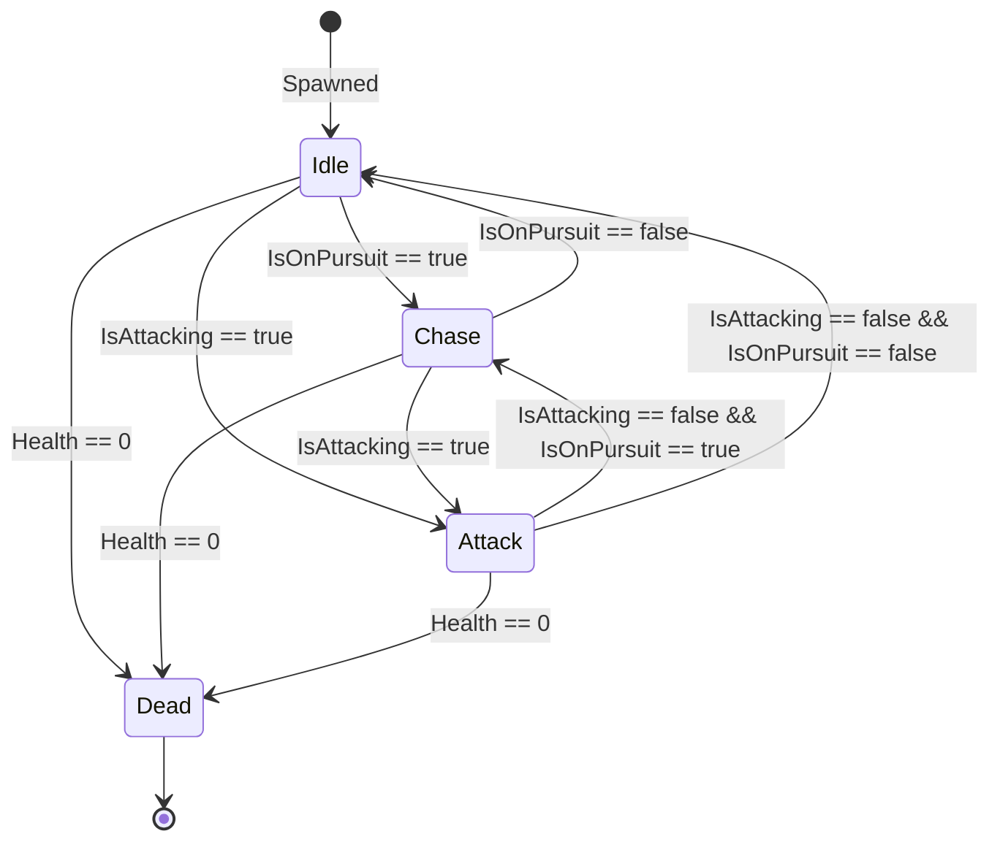

# Enemy Finite State Machine (EnemyFSM) Architecture

This document describes the design, responsibilities, and networking model of the Enemy Finite State Machine (FSM) implemented for Project Grimhold.

## Context & Objectives

The enemy AI entities require a robust, networked, and authoritative finite state machine to coordinate high-level behaviors: **Idle**, **Chase**, **Attack**, and **Dead**. 
The implementation ensures:
1. **Single Source of Truth**: State machine decisions and transitions are executed exclusively by the State Authority.
2. **Clear Separation of Concerns**: AI controllers (movement and combat) delegate high-level control to the active state.
3. **No Animator Dependency**: AI state logic is decoupled from visual/presentation layers (animator views, audio, etc.).
4. **Authority/Proxy Pattern**: Decisions are calculated and executed by the authority, and results/states are synchronized to proxies via networked properties.

---

## Component Overview

* **`EnemyFSM`**: The main network behaviour orchestrating the active state, handling state transitions, and synchronizing state across clients.
* **`IEnemyState`**: Interface defining the contract for all enemy states (`Enter`, `Exit`, `FixedUpdateNetwork`).
* **`EnemyIdleState`**: Enables movement, disables attack, transitions to `Chase` if pursuit starts, or `Attack` if attack range is reached.
* **`EnemyChaseState`**: Enables movement, disables attack, transitions to `Attack` or back to `Idle`.
* **`EnemyAttackState`**: Disables movement, enables attack execution, transitions back to `Chase` or `Idle` if no longer attacking.
* **`EnemyDeadState`**: Disables both movement and combat. Terminal state.

---

## Network Authority Model & Proxy Synchronization

* **State Authority**:
  * Runs the state logic in `FixedUpdateNetwork` during simulation ticks.
  * Checks transitions and updates `CurrentStateType` authoritatively.
* **Proxy Clients**:
  * Observe the replicated `CurrentStateType` networked property.
  * Sychronize their local `_currentState` reference during `Render()` for presentation/debug consistency.

---

## State Transitions

* **Dead state transition**: Triggered either via `EnemyCharacter.HandleDeath()` immediately upon reaching zero health, or dynamically as a fallback check during `FixedUpdateNetwork` in the active state if `!Character.IsAlive` is observed.

---

## Validation Strategy

1. **State Consistency**: Ensure only the State Authority can transition states.
2. **Resource Restraints**: Verify that during the `Dead` state, `IsControlEnabled` and `IsAttackEnabled` are both authoritatively set to `false`, preventing any movement or combat execution.
