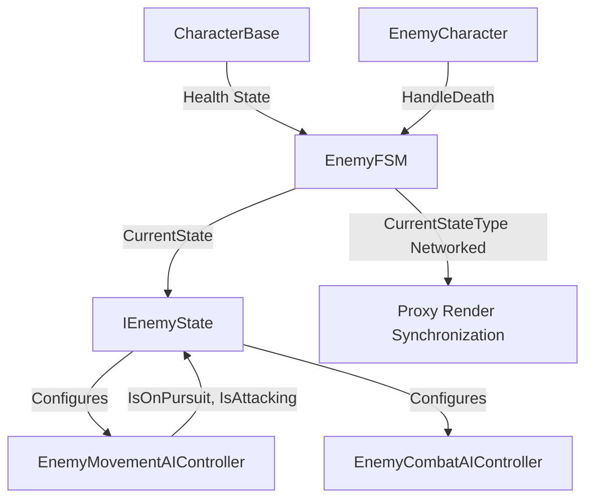
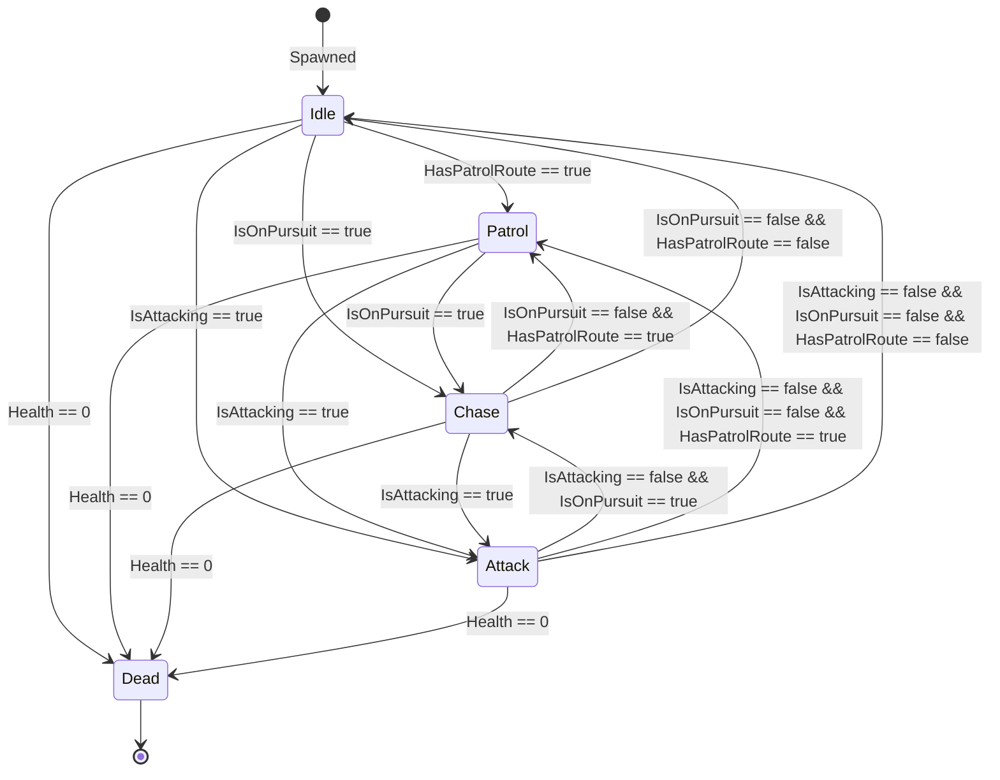

# Enemy Finite State Machine (EnemyFSM) Architecture

This document describes the design, responsibilities, and networking model of the Enemy Finite State Machine (FSM) implemented for Project Grimhold.

## Context & Objectives

The enemy AI entities require a robust, networked, and authoritative finite state machine to coordinate high-level behaviors: **Idle**, **Patrol**, **Chase**, **Attack**, and **Dead**.
The implementation ensures:
1. **Single Source of Truth**: State machine decisions and transitions are executed exclusively by the State Authority.
2. **Clear Separation of Concerns**: `EnemyMovementAIController` computes and exposes sensor flags; FSM states observe those flags and decide transitions. Neither layer duplicates the other's responsibility.
3. **No Animator Dependency**: AI state logic is decoupled from visual/presentation layers (animator views, audio, etc.).
4. **Authority/Proxy Pattern**: Decisions are calculated and executed by the authority, and results/states are synchronized to proxies via networked properties.

---

## Component Overview

* **`EnemyFSM`**: The main network behaviour orchestrating the active state, handling state transitions, and synchronizing state across clients.
* **`IEnemyState`**: Interface defining the contract for all enemy states (`Enter`, `Exit`, `FixedUpdateNetwork`).
* **`EnemyIdleState`**: Enables movement, disables attack. Transitions to `Patrol` (if patrol route is configured), `Chase`, or `Attack`. *(Patrol route: Etapa 2.)*
* **`EnemyPatrolState`** *(Etapa 2)*: Enables movement, disables attack. Enemy follows its configured waypoint route. Transitions to `Chase` or `Attack` when a target is detected.
* **`EnemyChaseState`**: Enables movement, disables attack. Transitions to `Attack`, or back to `Patrol`/`Idle` when pursuit ends.
* **`EnemyAttackState`**: Disables movement, enables attack execution. Transitions back to `Chase`, `Patrol`, or `Idle` when no longer attacking.
* **`EnemyDeadState`**: Disables both movement and combat. Terminal state.

---

## Sensor / Transition Separation

`EnemyMovementAIController` is the **sole writer** of `IsOnPursuit` and `IsAttacking`. These networked flags represent the output of the movement controller's sensor evaluation (OverlapCircle scan, LOS check, distance check).

FSM states are the **sole callers** of `EnemyFSM.TransitionTo`. They observe the sensor flags and decide transitions. They do not replicate sensor logic.

This separation ensures a single source of truth for both sensor state and FSM transitions.

---

## Detection Model

`EnemyMovementAIController` uses two complementary scan paths:

### Without active target (Idle / Patrol)
A `Physics2D.OverlapCircleNonAlloc` scan runs on a throttled interval (`_scanInterval`, default 0.1 s) against `_playerLayer`. Among valid candidates (alive, damageable, LOS clear), the closest is selected; ties broken by `EntityId.Value` (stable, deterministic across all peers). The scan uses a pre-allocated buffer — no heap allocation per tick.

### With active target (Chase / Attack)
Distance and `Physics2D.Linecast` LOS are evaluated directly every tick (O(1)). No OverlapCircle.

### Detection parameters

| Parameter | Purpose |
|---|---|
| `_detectionRange` | Radius within which the OverlapCircle scans for targets. |
| `_disengageRange` | Target is dropped only when it exceeds this radius (>= `_detectionRange`). |
| `_pursuitLostGraceTicks` | Ticks of continuous LOS loss before pursuit ends (within disengage range). |
| `_attackRange` | Distance at which `IsAttacking` becomes true (does not require LOS). |
| `_obstacleLayer` | LayerMask used for LOS Linecast and (Etapa 3) wall-steering CircleCast. |
| `_playerLayer` | LayerMask used exclusively for the OverlapCircle scan. |

---

## Network Authority Model & Proxy Synchronization

* **State Authority (host)**:
  * Runs `EvaluateSensors` and `FixedUpdateNetwork` every simulation tick.
  * Writes `IsOnPursuit`, `IsAttacking`, `FacingDirection`, `IsMoving`, `IsControlEnabled`, `ScanTimer`.
  * Runs FSM state logic and calls `TransitionTo` exclusively.
  * Writes `CurrentStateType` (networked).
* **Proxy Clients**:
  * Never execute `FixedUpdateNetwork` for enemy objects.
  * Observe replicated `CurrentStateType`, `FacingDirection`, `IsMoving` for presentation.
  * Synchronize their local `_currentState` reference during `Render()` for debug consistency.

Enemies are spawned without `inputAuthority`. They are never subject to client-side prediction or resimulation.

---

## State Transitions (Etapas 1 & 2)

* **Dead state transition**: Triggered via `EnemyCharacter.HandleDeath()` upon reaching zero health, or as a fallback check during `FixedUpdateNetwork` if `!Character.IsAlive`.

---

## Pending Extensions

| Feature | Etapa |
|---|---|
| `EnemyPatrolRoute` + `EnemyPatrolState` + waypoint index | 2 |
| `Idle → Patrol` transition | 2 |
| `EnemyObstacleAvoidance` (CircleCast wall-steering in `ComputePursuitDirection`) | 3 |

---

## Validation Strategy

1. **State Consistency**: Ensure only the State Authority can transition states and write sensor flags.
2. **Sensor Flag Single Write**: `IsOnPursuit` and `IsAttacking` are written exactly once per tick by `EvaluateSensors`. No other method writes them outside `TryInvalidateCurrentTarget` and `ClearCurrentTarget` (both require State Authority).
3. **Resource Restraints**: During `Dead` state, `IsControlEnabled` and `IsAttackEnabled` are both authoritatively `false`.
4. **Scan Determinism**: Target selection during OverlapCircle scans is deterministic (closest candidate, `EntityId.Value` tiebreaker). Does not depend on collider return order.
5. **No Scene Searches During Gameplay**: `FindObjectsByType` is not called during simulation. All target detection uses Physics2D queries against `_playerLayer`.
