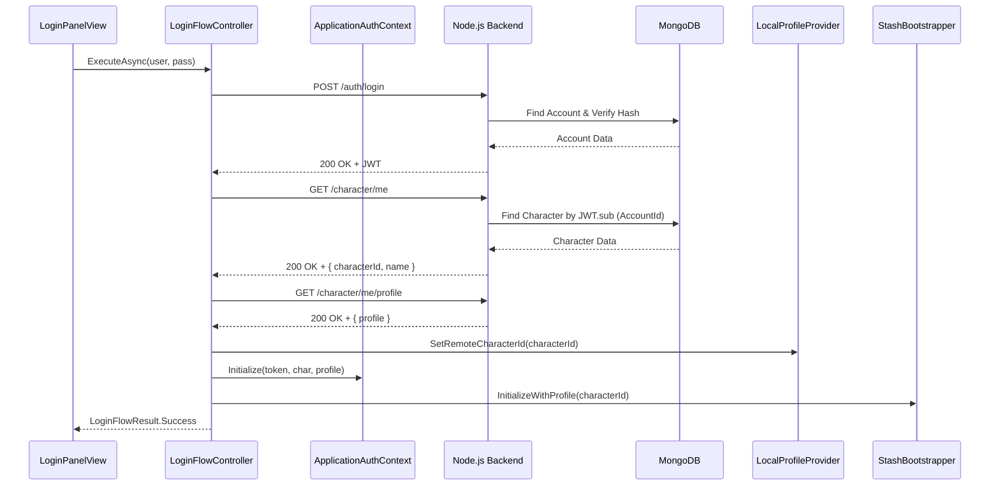

# Remote Identity and Authentication Architecture

## Context

Project Grimhold is transitioning towards a persistent, authoritative backend architecture. To support persistent progression, inventory, and social features, players require stable, globally unique identities that transcend local device state. Previously, identities were generated locally per-process as random GUIDs.

## Decision

The backend Node.js + MongoDB infrastructure is the sole authority over player accounts and characters. Unity authenticates with the backend and receives a token and an identity, which it then uses for all subsequent interactions.

### Authentication & Authorization

1.  **Identity Provider**: A custom Express.js backend running against a MongoDB instance.
2.  **Authentication Protocol**: HTTP POST to `/auth/login` with `username` and `password`.
3.  **Token Standard**: JSON Web Tokens (JWT) signed using a symmetric secret (`JWT_SECRET`).
4.  **Token Lifecycle**:
    *   Tokens are short-lived (configurable via `JWT_EXPIRES_IN`).
    *   The `sub` claim contains the internal `AccountId`.
    *   Tokens are passed in the `Authorization: Bearer <token>` header for all authenticated requests.
    *   Unity treats the JWT as an opaque string. It never attempts to decode or validate the signature client-side.

### Data Model & Boundaries

The backend maintains strict separation between the authentication concept (`Account`) and the gameplay concept (`Character`).

*   **Account**: Represents login credentials (`username`, `passwordHash`).
*   **Character**: Represents the player's avatar in the game world (`name`, `profile`).
    *   Currently, the system enforces a strict 1:1 relationship: One Account owns exactly One Character.
    *   The `accountId` acts as the foreign key linking a Character to an Account.
    *   **AccountId Opacity**: The `AccountId` is strictly an internal backend construct. It never travels in JSON response bodies to Unity, nor is it stored in Unity's memory. It only exists within the JWT `sub` claim.
*   **CharacterId / ProfileId**: The canonical identifier for a character is its MongoDB `_id` (`ObjectId`). When serialized to Unity, this is sent as the `characterId`.
    *   Unity adopts this remote `CharacterId` as its local `ProfileId`.
    *   This is the identity used for Town matchmaking, Stash allocation, and Fusion networking.

### Unity Client Architecture

The authentication flow is orchestrated by `LoginFlowController`, a non-UI component that executes the sequence:

1.  `AuthenticationClient.PostLoginAsync` -> Retrieves JWT.
2.  `CharacterClient.GetCharacterAsync` -> Retrieves `CharacterId` and name.
3.  `CharacterClient.GetProfileAsync` -> Retrieves the profile snapshot (e.g., `customNote`, `lastSeen`).
4.  Injects the remote `CharacterId` into `LocalProfileProvider`.
5.  Populates `ApplicationAuthContext` with the active token and character data.
6.  Invokes `ApplicationStashServiceBootstrapper.InitializeWithProfile` to spin up the local stash bound to this identity.

### Constraints & Future Work

*   **No Direct DB Access**: Unity never talks directly to MongoDB. All communication is via HTTP REST to the backend.
*   **Fusion Boundary**: Photon Fusion receives the `ProfileId` (which is now the remote `CharacterId`) to identify players in a session. However, Fusion itself does *not* validate JWTs or perform authentication. The Town server (State Authority) will eventually need to validate player identities against the backend, but currently, it trusts the `ProfileId` provided by the client during connection.
*   **HTTPS**: Development currently occurs over HTTP. Production deployments must enforce HTTPS for all backend communication to secure credentials and JWTs in transit.
*   **Temporary Persistence**: While `customNote` and `lastSeen` persist remotely, core gameplay state (Stash, Loadout, Receipts) currently remains local and temporary per process (as defined in `LocalPlayerPersistenceArchitecture.md`). Subsequent roadmap stages will migrate these to the authoritative backend.
