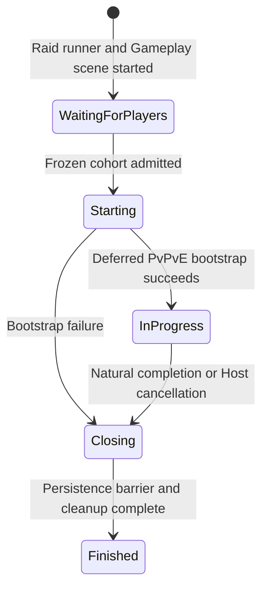

# Session Lifecycle & Spawning Architecture

This document specifies the Raid runner lifecycle, the authoritative transition from frozen
admission to active gameplay, late-join prevention, player participation/avatar spawning, and the
fresh-session boundary preserved by Host Migration.

Raid preparation and cohort freeze are specified in
`Docs/Architecture/TownRaidQueueArchitecture.md`. Participant ownership is specified in
`Docs/Architecture/RaidParticipantArchitecture.md`. Raid-generation closure, persistence barriers
and repeatable cleanup are specified in
`Docs/Architecture/RaidGenerationLifecycleArchitecture.md`. Host Migration recovery and roster
sealing are specified in `Docs/Architecture/HostMigrationRecoveryArchitecture.md`.

---

## 1. Match phases

`NetworkMatchController` owns the single replicated `MatchPhase` for one Raid generation.



- **`WaitingForPlayers`** is a technical Raid admission phase. The Gameplay scene is already
  loaded, only profiles frozen in the Town launch context may join, and there is no second
  player-facing Start action in this runner.
- **`Starting`** closes and hides the session and executes the one-time initial PvPvE bootstrap.
- **`InProgress`** is active Raid simulation.
- **`Closing`** waits for required persistence acknowledgements and performs authoritative cleanup.
- **`Finished`** retains the result-bearing objects needed by the individual Results flow.

Only State Authority changes the phase. `NetworkMatchController.Spawned()` initializes a fresh
session to `WaitingForPlayers`; Host Migration restoration preserves the copied phase instead.

## 2. Runner-scoped composition

`FusionSessionLauncher` owns the active Raid runner. `NetworkRunnerFactory` creates its
runner-scoped composition before `StartGame`, including `NetworkSpawnManager`. The launcher passes
the productive `NetworkPlayer` avatar prefab, the separate `NetworkRaidParticipant` prefab, enemy
prefabs and the immutable `SessionStartupContext` into that composition.

`NetworkMatchController` is spawned by the fresh Host from the registered coordinator prefab with
`NetworkSpawnFlags.DontDestroyOnLoad`; Fusion, rather than a local
`UnityEngine.Object.DontDestroyOnLoad` call, owns its scene persistence. It binds itself to the
runner's `NetworkSpawnManager` in `Spawned()`.

The spawn manager is initialized explicitly for one runner and uses only that runner's scene and
callbacks. `OnShutdown` clears admission, spawn, configuration and recovery registries, unbinds the
coordinator and drops the runner reference so no later runner can inherit state.

## 3. Frozen admission and character state

Town freezes the participant profile cohort in `RaidLaunchContext`. Immediately before the Raid
transition, each local application creates its Loadout reservation. `FusionSessionLauncher` then
reads the confirmed profile from `LocalProfileStore` and encodes a versioned `RaidAdmissionData`
token containing:

- the Raid code and remote `CharacterId` represented locally as `ProfileId`;
- the reservation id, reserved Loadout and six prepared Equipment references;
- the confirmed Level, current Experience and progression-result watermark;
- the complete confirmed `CharacterAttributeState`, including available attribute points.

Raid admission validates the token against the frozen launch context and prepared Loadout rules;
it does not accept an open late-join roster.

For a fresh player spawn, State Authority creates `NetworkRaidParticipant` first and initializes it
from the admitted identity, progression baseline and attributes. The participant copies all six
attributes plus available points into its replicated state and publishes its initialization marker
only after the full snapshot is written. That snapshot is frozen for the participation;
redistribution and profile persistence remain outside the Raid runtime.

State Authority then creates exactly one productive `NetworkPlayer` avatar, links
`RaidAvatarParticipantLink.ParticipantId` to the participant, initializes the admitted Loadout and
Equipment on the avatar, records `CurrentAvatarId` on the participant, and finally calls
`runner.SetPlayerObject(player, participantObject)`. The participant—not the avatar—is therefore
the stable Fusion `PlayerObject`.

If participant creation, avatar composition, Loadout/Equipment initialization or bidirectional
linking fails, State Authority despawns the partial objects and retains no partially admitted
participation.

## 4. Participant and avatar lifecycle

`NetworkRaidParticipant` owns the participation's stable `ProfileId`, Raid generation,
`RaidParticipantId`, frozen attributes, progression ledger/resolver, terminal state and current
avatar reference. The avatar owns the temporary physical and gameplay composition: health,
movement, combat, interaction, Raid inventory, Equipment, extraction and local presentation.

On definitive defeat, `PlayerCorpseGenerationController` atomically converts the avatar's
inventory and Equipment into its co-located `NetworkLootContainer`. Only after that material
handoff succeeds does `RaidAvatarParticipantLink` mark the participant `Defeated`, clear
`CurrentAvatarId` and remove avatar Input Authority. The same avatar NetworkObject remains spawned
as the authoritative lootable corpse; the separate participant remains the `PlayerObject` while
the connected player is eligible for terminal Results/spectator flow.

The defeated corpse is not the player identity and never becomes `PlayerObject`. Conversely, the
participant does not own physical loot or colliders. Shutdown and controlled lifecycle cleanup
remove their respective objects and registrations according to the participant result and Raid
closure contracts.

## 5. Scene-load generation and configuration

`NetworkSpawnManager` uses an incremental scene-load generation rather than a scene-path identity.
Its states are:

- `None`: no load is being processed;
- `Pending`: scene loading started and spawning is locked;
- `Processing`: the runner scene is being resolved and initial admitted players are spawned;
- `Failed`: lookup, validation or spawning failed and spawning remains locked;
- `Completed`: the fresh generation finished and permitted spawning is unblocked;
- Host Migration barrier states described in section 9.

`OnSceneLoadStart` increments the generation, clears spatial lookups and blocks spawns.
`OnSceneLoadDone` resolves configuration strictly inside
`runner.SceneManager.MainRunnerScene`; it never falls back to Unity's active scene. Multiple or
invalid required configurations fail closed. Configuration is applied before pending player
spawns, which occur before initial world-entity bootstrap.

`SceneSpawnPointPolicy.NotRequired` completes without scene-point spawning.
`SceneSpawnPointPolicy.Required` requires one valid `NetworkSpawnSceneConfiguration` and produces
`SpawnPointsReady`. Scene-point spawning requires a completed generation and that status;
explicit-transform spawning uses its separate authority check and does not consume configured
points.

## 6. Initial world spawning

Initial scene groups use explicit dispatch:

```text
Players    -> SpawnPlayer
Enemies    -> SpawnEnemy
Loot       -> SpawnLootContainer
Breakables -> SpawnBreakable
NPCs / Bosses / Misc -> warning and skip
```

Unsupported groups never fall back to an enemy prefab. Missing or invalid Loot configuration skips
only Loot; it does not replace the player or enemy policy.

Initial Loot and Breakables use runner-local, generation-idempotent point records. State Authority
derives a deterministic per-point seed from the session seed, scene generation, group and point
index, and combines it with the effective Luck probability of the frozen initial Raid cohort.
Clients receive the replicated pending descriptor; the actual roll is deferred to the chest's
first valid opening or the breakable's fatal hit. A point is recorded only after `Runner.Spawn`,
pre-spawn descriptor initialization and production availability all succeed; a failed spawn is
despawned and the point remains retryable with the same descriptor. Once spawned, terminal
`Resolved` and `Failed` state prevents rerolls, including across Host Migration. The next
generation and shutdown clear only the runner-local point records.

## 7. Fail-closed player spawning

`CanSpawnPlayer` rejects a fresh spawn unless all current conditions hold:

- the callback runner is the manager's initialized server runner;
- scene loading is `Processing`, or is `Completed` with `SpawnPointsReady`;
- the coordinator exists on the same runner;
- the `PlayerRef` is non-empty and has completed admission;
- neither the spawn registry nor `runner.GetPlayerObject(player)` already contains a participant;
- both the productive Raid avatar and participant prefab references are valid;
- the match phase is `WaitingForPlayers`, `Starting` or `InProgress`.

Admission additionally requires a valid token and frozen-cohort membership. The spawn index and
stable `RaidParticipantId` are derived from the frozen profile ordering. `PlayerRef` is reusable by
Fusion and is never treated as durable identity; `ProfileId` owns logical identity across the Raid
and Host Migration.

## 8. Admission closure and Raid start

The fresh Host configures the expected frozen-cohort count and a bounded technical admission
deadline. When every expected profile has completed participant/avatar bootstrap,
`NetworkMatchController.TryStartRaid()` moves to `Starting`, closes and hides the session, and asks
the spawn manager to execute the deferred initial PvPvE bootstrap exactly once. Success publishes
`InProgress`. Failure enters the explicit `BootstrapFailure` closure path; it never silently starts
with a partial cohort.

The phase transition does not load Gameplay: the Raid runner started with that scene already
selected. Town Create/Join/Ready and the player-facing Host Start remain owned by
`TownRaidQueueArchitecture.md`.

## 9. Host Migration resume

`SessionStartupContext` has two modes:

- `FreshSession` permits Host coordinator creation, fresh phase initialization, participant/avatar
  admission and initial scene-entity bootstrap.
- `HostMigrationResume` suppresses every fresh bootstrap path. Scene loading reaches
  `AwaitingHostMigrationRestore`, spawning stays blocked and no new session seed is generated.

Only the replacement `GameMode.Host && IsServer` executes snapshot restoration. Dynamic objects are
recreated from the Fusion snapshot, use snapshot `NetworkTRSP` for their initial transform, receive
`CopyStateFrom` during `onBeforeSpawned`, and suppress fresh state initialization through the
restore-spawn guard. Scene objects are hydrated separately. The restorer remaps dynamic
`NetworkId` references before the roster is rebound.

The copied participant state includes its terminal state, progression ledger/resolver and frozen
`CharacterAttributeState` plus initialization marker. The copied avatar state includes current
Health and Stamina state. Reference fixup reconnects the avatar and participant; effective maxima
are derived again from the restored frozen attributes, while copied current resources are not
reinitialized or healed.

Recovery admission is disjoint from fresh admission. Early arrivals are queued by `ProfileId`
without spawning new participants or avatars. After restore, an eligible arrival is rebound to its
existing participant, which becomes its `PlayerObject`; a `Raiding` avatar receives the new Input
Authority. A restored `Defeated` participant has no current avatar, while its independent lootable
corpse remains without Input Authority.

Snapshot restore reaches `SnapshotRestoredAwaitingRuntimeRebind`; it is not completion. The Host
opens a bounded recovery roster, rebinds eligible profiles, atomically seals it, terminalizes
unrecovered participants under `HostMigrationRecoveryArchitecture.md`, validates all remaining
PlayerObject/avatar authorities, and only then publishes recovery completion. A replacement Client
never runs restore or sealing; it waits for its replicated local participant mapping before the
launcher adopts the runner.

## 10. Launcher shutdown and replacement

`FusionSessionLauncher` guards startup with `_isStarting` and resets it through `try/finally`.
Failures after `StartGame` use the controlled asynchronous shutdown path and destroy the failed
runner object. The launcher remains the sole long-lived owner; a Host Migration replacement is not
adopted merely because `StartGame` returned successfully.

`SessionConnectionCoordinator` owns Town-to-Raid and Raid-to-Town runner replacement. UI,
participants and avatars expose state or typed intentions but never shut down a runner or load the
Town scene directly. `LocalInputContext` and local presentation binders clear reader, targets,
suppression tokens and listeners so a later runner cannot inherit local state.

## Validation boundary

EditMode and Single Runner PlayMode tests can verify phase policy, admission validation, prefab
composition, frozen attribute roundtrip, spawn idempotency, participant/avatar ownership, defeat
conversion and restore guards. They do not prove real Host Migration or Host/Client isolation.

Manual/integration validation must cover a fresh Solo Raid, frozen multi-client admission, rejected
late join, partial-admission timeout, bootstrap failure, definitive defeat with a lootable corpse,
complete runner replacement, and a multi-process Host Migration that restores participant/avatar
links, frozen attributes, copied current resources and final PlayerObject authorities.
